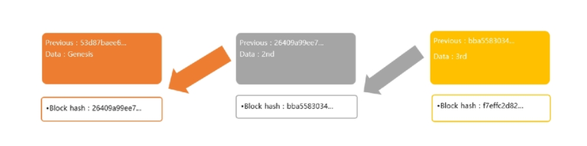
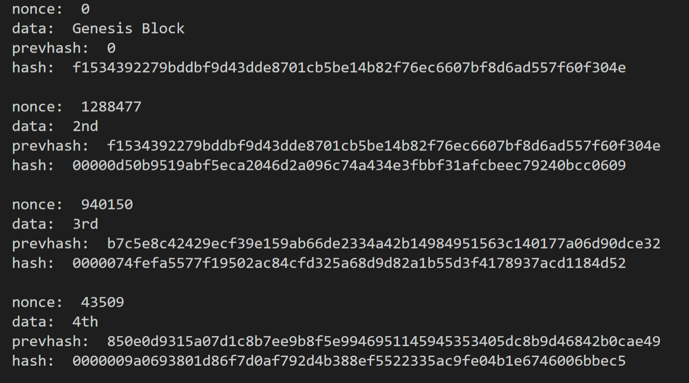

# 블록체인 미니 PJT README

[TOC]

**들어가기에 앞서**

`이번 미니 프로젝트를 하며 블록체인에 대한 기본적인 개념이해와 이를 직접 python 코드로 구현해보는 시간을 가져봤습니다.!`


## 프로젝트 사전준비(구현 계획)

### 블록체인의 개념

- `블록체인(block chain)은 관리 대상 데이터를 '블록'이라고 하는 소규모 데이터들이 P2P 방식을 기반으로 생성된 체인 형태의 연결고리 기반 분산 데이터 저장 환경에 저장하여 누구라도 임의로 수정할 수 없고 누구나 변경의 결과를 열람할 수 있는 분산 컴퓨팅 기술 기반의 원장 관리 기술이다. 이는 근본적으로 분산 데이터 저장기술의 한 형태로, 지속적으로 변경되는 데이터를 모든 참여 노드에 기록한 변경 리스트로서 분산 노드의 운영자에 의한 임의 조작이 불가능하도록 고안되었다. 블록체인 기술은 비트코인을 비롯한 대부분의 암호화폐 거래에 사용된다. 암호화폐의 거래과정은 탈중앙화된 전자장부에 쓰이기 때문에 블록체인 소프트웨어를 실행하는 많은 사용자들의 각 컴퓨터에서 서버가 운영되어, 중앙에 존재하는 은행 없이 개인 간의 자유로운 거래가 가능하다`


### 블록과 체인 구현

- `블록`: 관리 대상 데이터
- `체인`: 연결고리
- 위키 정의를 다시 보며 의미를 추출해보면 데이터와 연결고리로 정의 되어 있다. 이걸 코드로 구현하려고 생각해본다면 구조체(객체) 값에 링크드 리스트로 엮은 모습과 비슷하게 된다. 실제로는 포인터 참조가 아닌 해시값 참조로 연결되어 있다. 그럼 해시란 무엇일까?

### 블록 해시

- `해시함수`: 임의의 길이의 데이터를 고정된 길이의 데이터로 매핑하는 함수
- 쉬운 예로 나머지(modulas)를 들 수 있습니다. n 값의 나머지 m 을 구하면 0에서 m-1 범위의 값이 구해집니다. n을 1로 줘도 되지만 엄청 큰 수를 준다고 해도 결과값은 0에서 m-1 범위의 값일 뿐입니다. m 값만으로는 n 값을 정확히 되돌리지는 못합니다.
- 해시함수는 다음과 같은 특성이 있습니다.
  - 뭘 넣든 비슷한 길이의 알 수 없는 난수가 결과로 출력이 된다.
  - 글자가 한글자만 바뀌어도 완전히 다른 결과가 출력이 된다.
  - 출력값으로 입력값을 예측할 수 없다.
  - 같은 내용을 입력값으로 주면 결과값은 항상 같다.
- 블록에는 어떠한 데이터가 담겨 있을 건데, 이것을 해시하면 결국 **고정된 길이의 해시값**이 나오게 된다.

### 블록 구현

- 블록은 구조체로 표현할 수 있다. 구조체 안에 넣을 수 있는 내용들은 다음과 같다.
  - 이건 블록의 해시값을 기억할 변수
  - 현재 블록에서 간직해야 할 데이터

### 블록체인 구현

- 블록을 생성했다면 직전에 만든 블록과 관계를 맺어주어야 한다. 그 관계는 해시값을 통해서 가질 수 있다.  
- 이전의 블록 해시값을 현재의 블록이 기억을 해둔다. 그리고 그렇게 생성된 블록의 해시값은 또 다음 블록이 기억을 하게 된다. 
- 이렇게 블록생성 마다 이런 과정을 반복적으로 해줌으로써 블록관의 관계가 맺어지게 되고 이를 블록체인이라고 한다.


#### 구현된 블록체인 이미지



### Nonce

- 위의 그림을 예시로 하여 컴퓨터에게 블록을 빨리 만들지 못하도록 Nonce 값을 조정해 보려고 한다.
- 위의 예에서 첳ㅅ번째 블록 해시값은 "26409..." 이다. sha256 같은 해시함수를 사용하여 빠르게 값이 구해진다. 그리고 2번째 블록에서는 이 값을 보관한 상태로 해시값을 구한다. 그러면 "bba5583034.."값이 구해진다.
- 때문에 '0'으로 시작하는 해시값만 사용해 블록체인을 구현해 볼 것이다.(앞자리가 0이 5개)
- 해시값이 바로 '0'으로 시작되지 않고 `nonce`값을 조정하며 '0'이 5자리가 될때까지 계속해서 변경을 가해볼 것이다.
  - 정수형(integer) 변수를 추가해 0부터 값을 줘 해시값을 구해보고 조건에 맞지 않으면 1씩 증가시켜 보는 방식(기존 코인 마이닝과 동일하다)
  - 이렇게 조건에 맞는 해시값이 구해지게 되면 새로운 블록이 생기게 된다.(마이닝 성공이라고 할 수 있을까... 여기에 보상만 받으면 코인 마이닝과 동일한 개념인 것 같다.)

#### 첨언: 해시넷의 논스 설명 인용

- `논스(nonce)`는 비트코인의 창시자인 `사토시 니카모토`가 쓴 비트코인 백서에 나오는 용어이다.
- 블록체인은 다수의 거래내역을 모아 하나의 블록을 구성하고, 그 블록을 대표하는 해시값을 생성하여 다른 블록과 체인처럼 연결된다. 이 때, 블록을 대표하는 해시값인 `블록해시`를 생성하려면, 일정한 조건을 만족해야 한다. 그 일정한 조건이란, 블록 난이도에 따라 자동으로 설정된 '목표값'보다 더 작은 블록해시값을 찾아야 한다는 제약조건이다. 해시는 랜덤하게 생성되기 때문에, 수없이 많은 연산을 반복해서 미리 정해진 목표값 이하의 해시값이 나오도록 해야한다. 이 때 랜덤한 해시값을 생성할 수 있도록 매번 임시값을 사용해야 하는데, 이 임시값이 바로 `논스`이다.


### 추가) 해시함수 활용 사례

| 활용사례                    | 내용                                                         |
| --------------------------- | ------------------------------------------------------------ |
| 소프트웨어 변경 검출        | 배포한 소프트웨어의 불법적인 변경 여부를 점검하는 로직으로 사용, CRC에서 HASH 함수로 발전했음. |
| 패스워드를 기초로 한 암호화 | PBE(password based encryption)에서 활용하는 key를 password와 salt의 조합을 hash 함수로 암호화 하여 암호화 키로 활용 |
| 메세지 인증코드             | 네트워크 송수신이나 대용량 자료의 송수신 무결성 검증을 위해 활용 |
| 디지털 서명                 | 디저털 서명 시 해당 거래의 신속한 처리를 위해 Message Digest를 암호화하여 송신함으로써 무결성 및 인증을 수행 |
| Data De-duplication         | Cloud 데이터 저장공간을 확보하는 기술로, 기 존재하는 Data인지 여부를 hash 값을 기반으로 하여 검증하는데 활용 |

---


## 블록체인 구현 결과와 구현 과정 및 코드


### 블록체인 구현결과(출력 결과)




### 내가 직접 짜본 블록체인 코드

```python
from hashlib import sha256
from datetime import datetime

# haslib를 활용해 sha256을 구현하는법 이해하기 연습
# test_content = 'test string for making hash'
# test_hash = sha256(test_content.encode())
# print(test_hash.hexdigest())

# 블록체인을 만들어보자
class Block:
    def __init__(self, prevhash, nonce=0):
        # 후에 POW 과정을 거치며 nonce 값을 자동으로 조정해줄거임.
        self.timestamp = datetime.now() # 아쉬우니간 생성시간도 만들어줌
        # self.data = name  # 초기에는 테스틀 위해 블록의 이름은 클래수 변수에 내가 직접 입력해주는 것으로 설정함.
        self.data = input() # 블록을 생성 할 때 그냥 이름을 직접 입력해주자.(자동으로 이름을 만들어주기 귀찮다,,ㅎㅎ)
        self.prevhash = prevhash
        self.nonce = nonce
        # generate_hash() 함수를 직접 만들어서 해시를 생성
        self.hash = self.generate_hash()

    def print_block(self): # 구현 결과를 확인하기 위한 프린트문
        print("nonce: ", self.nonce)
        print("data: ", self.data)
        print("prevhash: ", self.prevhash)
        print("hash: ", self.generate_hash())

    def generate_hash(self):
        # block contents의 nonce 변수를 변경해 해시값도 함께 변경해주도록 구현
        block_contents = str(self.nonce)+str(self.prevhash)
        block_hash = sha256(block_contents.encode())
        return block_hash.hexdigest()

# 블록이 잘 만들어지는지 확인
# Genesis_Block = Block("Genesis Block", 1, 0, 0)
# test = Block(0)
# Genesis_Block.print_block()
# test.print_block()


# 이전에 만든 블록을 가지고 실제로 이전 블록과 다음 블록을 연결하는 BlockChain 만들기
class Blockchain:
    def __init__(self):
        self.chain = [] # 모든 블록을 저장할 chain list
        self.genesis_block()
    # genesis block(첫 블록)을 생성하는 메소드 추가
    def genesis_block(self):
        block = Block(0)
        self.chain.append(block)
        return self.chain
    # 새로운 block 추가하기
    def add_block(self):
        previous_block_hash = self.chain[len(self.chain)-1].hash # block 리스트(chain)에서 가장 마지막 놈의 hash 값을 가져옴
        new_block = Block(previous_block_hash) # 이전 해시값을 가진 새로운 블록 생성
        proof = self.proof_of_work(new_block) # 00000으로 시작하는 hash 값과 이를 위한 nonce 값을 지니도록 만들어줌.
        self.chain.append(new_block) # 완료됐다면 chain에 추가.
        return proof, new_block

    # 블록체인 작업증명 함수 추가(POW)
    # difficulty = 5 로 설정함으로써 자동으로 내부에서 00000으로 시작하는 hash 값을 찾기위해 계속 nonce값을 더해간다.
    def proof_of_work(self, block, difficulty=5):
        proof = block.generate_hash()

        while proof[:5] != '0'*difficulty:
            block.nonce += 1
            proof = block.generate_hash()
        return proof

# test = Blockchain()
# genesis block이 잘 만들어졌는지 확인
# print(test.chain)

# 새로운 블록 추가
# test.add_block()
# 새로운 블락이 추가된것을 확인 할 수 있다.
# print(test.chain)

# 전체 배열의 마지막 블록도 출력해보자
# print(test.chain[-1])

HyunchangChain = Blockchain()
# print(HyunchangChain.chain) # Genesis block 잘 만들어졌는지 확인

# 명세서대로 3개 이상의 블록을 추가로 만들어 주자.
# 나 같은 경우는 세개의 블럭을 추가로 만들어 chain에 총 4개의 블록이 담기게 했다.
# 각각의 이름
'''
Genesis Block
2nd
3rd
4th
'''
for _ in range(3):
    HyunchangChain.add_block()
# 잘 만들어졌는지 확인
# print(HyunchangChain.chain)

# 결과물 출력
for block in HyunchangChain.chain:
    block.print_block()
    print()

# 꽤 빠르게 출력됨을 알 수 있다. 만약 difficulty 를 올리면 출력 시간이 기하급수적으로 늘어나게 된다.
# 성공적으로 이번 과제를 수행했음을 알 수 있다.
```